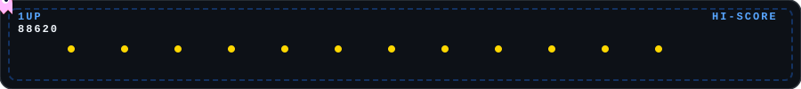

 

 

<!-- Pacman animation strip -->

 

## 🧭 Tentang Saya

> Fresh Graduate Sarjana Informatika dari Telkom University yang memiliki minat dan keahlian mendalam di bidang Software Engineering, Pengembangan Game, Operasional IT (IT-OPS), dan Kecerdasan Buatan (AI/NLP). 
<table>
<tr>
<td width="50%" valign="top">

**📍 Profil Singkat**
| | |
|---|---|
| 🎓 Kampus | Telkom University — S1 Informatika |
| 📅 Lulus | 06 Mei 2026 |
| 📊 IPK | 3.01 / 4.00 |
| 🌆 Lokasi | Bekasi, Indonesia |
| 💼 Fokus Karier | IT Support & System Specialist |

</td>
<td width="50%" valign="top">

**⚡ Fun Facts**
- 🎮 Mengelola server Roblox live dengan **1.000+** pemain bersamaan
- 🧠 Model NLP-nya mencapai akurasi **88.62%**
- 🎨 Merancang ulang UI resmi JKT48 secara mandiri
- 🤖 Membangun sistem helpdesk IT dengan AI (Gemini API)

</td>
</tr>
</table>

 

## 🛠️ Tech Stack

**Languages & Frameworks**
 

**Data / ML**
 

**Tools & Design**
 

 

## 🚀 Proyek Unggulan

<table>
<tr>
<th align="left" width="20%">Proyek</th>
<th align="left" width="45%">Deskripsi</th>
<th align="left" width="35%">Tech</th>
</tr>

<tr>
<td>🕵️ <b>Multilingual Hoax Detection</b> Final Thesis</td>
<td>Sistem deteksi hoax otomatis lintas 5 bahasa (EN, HI, ID, SW, VI), dengan 2 skenario eksperimen. Akurasi puncak <b>88.62%</b> pada model IndoBERT untuk dataset gabungan hasil translasi.</td>
<td></td>
</tr>

<tr>
<td>🎫 <b>IT-Ticketing Tool</b> Personal Project</td>
<td>Sistem helpdesk IT full-stack dengan kategorisasi & scoring urgensi tiket otomatis via Gemini API. Backend ringan dengan persistensi database lokal yang aman.</td>
<td></td>
</tr>

<tr>
<td>🎨 <b>JKT48 Website UI Redesign</b> Personal Project</td>
<td>Redesign UI/UX halaman resmi berbasis analisis usability. Prototipe web interaktif high-fidelity dengan design system dan carousel dinamis.</td>
<td></td>
</tr>

<tr>
<td>🕹️ <b>Eternia Forest</b> Roblox Game</td>
<td>Game multiplayer yang dikembangkan bersama tim kecil, meraih 300K+ visits dan 1.000 pemain aktif bersamaan di puncak aktivitas.</td>
<td></td>
</tr>

</table>

 

## 🎓 Pendidikan

**Bachelor of Informatics** — Telkom University, Bandung
*Terakreditasi Unggul (BAN-PT No. 164/SK/LAM-INFOKOM/Ak/S/VIII/2025)*

| Tahap | SKS Lulus | IPK |
|---|---|---|
| Tingkat I | 47 | 3.24 |
| Tingkat II | 28 | 2.29 |
| Tingkat III | 39 | 3.15 |
| Tingkat IV | 30 | 3.15 |
| **Total** | **144** | **3.01** |

📌 **Tugas Akhir:** *Deteksi Hoax Menggunakan Model Multilingual Transformers dan IndoBERT* — mengembangkan framework NLP berbasis IndoBERT, mBERT, dan XLM-R untuk identifikasi berita palsu lintas bahasa.

 

## 📜 Sertifikasi

- 🐍 Scientific Computing with Python — freeCodeCamp (2025)
- 🌐 Responsive Web Design — freeCodeCamp (2024)
- 🏸 Badminton Pose Time Series Classification using LSTM — Telkom University (2025)

 

## 📊 GitHub Stats

 

## 📫 Mari Terhubung

Terbuka untuk peluang magang / entry-level di bidang **IT Support**, **System Administration**, atau **Data/ML**.

